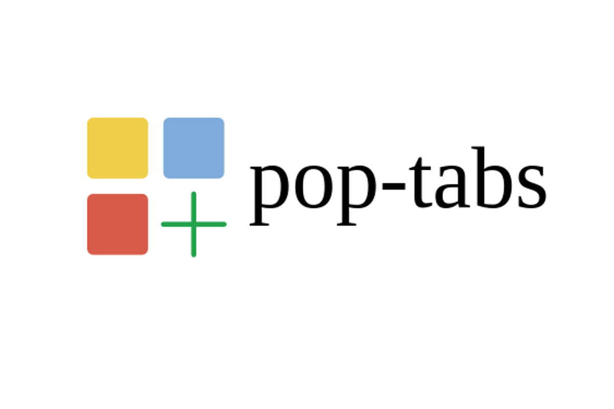

# Pop tabs

Chrome extension to manipulate smartly and quickly numerous opened tabs.

## Publish on Chrome Web store

See dashboard https://chrome.google.com/webstore/developer/dashboard .

     
## Screenshot

